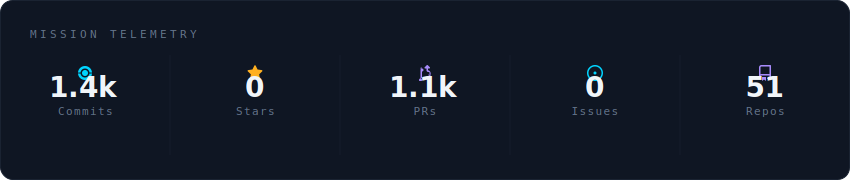
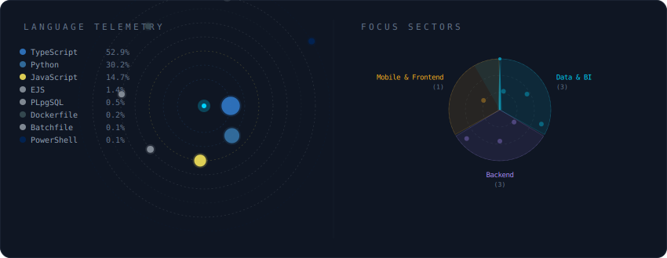

<!-- Galaxy Profile README
     SVGs are auto-generated by GitHub Actions or by running: python -m generator.main -->

  

 

  

 

  

 

<strong>Mais sobre mim</strong>

 

Engenheiro de Producao & Administracao com multiplos MBAs.
Atuando na interseccao entre tecnologia e negocios, focado em transformar dados em insights e resultados de impacto para as organizacoes.

Certificacoes relevantes na area de TI e metodologias ageis.

 

  
  
  

