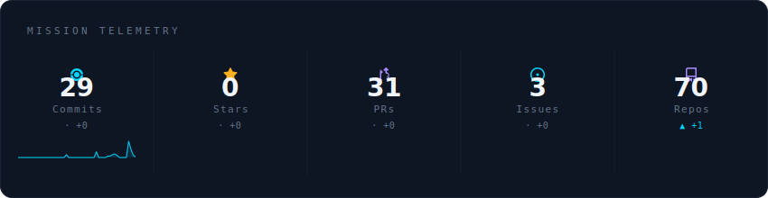
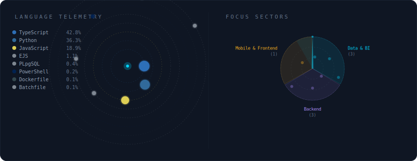
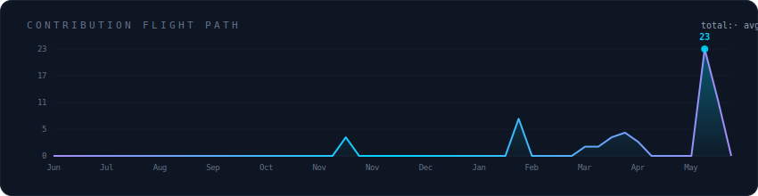

<!-- ━━━━━━━━━━━━━━━━━━━━━━━━━━━━━━━━━━━━━━━━━━━━━━━━━━━━━━━━━━━━━━━━━━━━━━━━ -->
<!--  Galaxy Profile README · Marcelo Braga dos Santos                        -->
<!--  Os widgets de stats puxam dados REAIS do GitHub (incluindo repos privados) via       -->
<!--  GitHub Actions workflow com PAT autenticado (a cada 12h) +   -->
<!--  streak-stats e profile-trophy como serviços externos.                    -->
<!-- ━━━━━━━━━━━━━━━━━━━━━━━━━━━━━━━━━━━━━━━━━━━━━━━━━━━━━━━━━━━━━━━━━━━━━━━━ -->

<!-- ═══════════════════════ HERO HEADER ═══════════════════════ -->

<a href="https://github.com/marcelobragadossantos">
  
</a>

<!-- ═══════════════════════ TYPING SUBTITLE ═══════════════════════ -->

<div align="center">
  <a href="https://git.io/typing-svg">
    
  </a>
</div>

<!-- ═══════════════════════ QUICK BADGES ROW ═══════════════════════ -->

<div align="center">
  <a href="https://www.linkedin.com/in/marcelo-braga-dos-santos-9479b130/">
    
  </a>
  <a href="mailto:marcelo.bragadossantos@gmail.com">
    
  </a>
  <a href="https://instagram.com/olecram_braga">
    
  </a>
  
  
</div>

<br/>

<!-- ═══════════════════════ GALAXY IDENTITY HEADER ═══════════════════════ -->

<div align="center">
  
</div>

<br/>

<!-- ═══════════════════════ SOBRE MIM ═══════════════════════ -->

<h3 align="left">
  
  &nbsp;<code>~/whoami.md</code>
</h3>

```yaml
name:     Marcelo Braga dos Santos
role:     Business Intelligence & Data Science
location: Brasil
focus:    ["Dados", "BI", "Automação", "Backend"]
mbas:     múltiplos
stack:    Python · PostgreSQL · Power BI · FastAPI · NestJS · React Native
mission:  "Transformar dados em insights para decisões de impacto."
```

<details>
<summary><strong>🛸 Mais sobre mim</strong></summary>

<br/>

Engenheiro de Produção & Administração com múltiplos MBAs, atuando na interseção entre **tecnologia e negócios**. Foco em transformar dados em insights e resultados de impacto para as organizações.

Trabalho diariamente com pipelines de dados, dashboards executivos, automações e integrações entre sistemas. Acredito que todo bom produto de dados começa com **perguntas bem feitas** e termina com **decisões tomadas**.

- 🎓 **Formação:** Engenharia de Produção + Administração + MBAs em Gestão e TI
- 📊 **Atuação:** BI, Data Science, automação de processos, backend para produtos de dados
- 🌱 **Estudando:** Data engineering, MLOps e arquiteturas event-driven
- 💬 **Pergunte-me sobre:** modelagem dimensional, Power BI, Python para dados, APIs com FastAPI

</details>

<br/>

<!-- ═══════════════════════ MISSION TELEMETRY ═══════════════════════ -->

<h3 align="center">
  
  &nbsp;Mission Telemetry&nbsp;
  
</h3>

<p align="center">
  <em>Dados reais (incluindo repos privados) — atualizados a cada 12h via GitHub Actions.</em>
</p>

<div align="center">
  
</div>

<div align="center">
  <a href="https://git.io/streak-stats">
    
  </a>
</div>

<br/>

<!-- ═══════════════════════ LANGUAGE TELEMETRY ═══════════════════════ -->

<h3 align="center">
  🌌&nbsp;Language Telemetry&nbsp;🌌
</h3>

<div align="center">
  
</div>

<br/>

<!-- ═══════════════════════ CONTRIBUTION FLIGHT PATH ═══════════════════════ -->

<h3 align="center">
  📡&nbsp;Contribution Flight Path&nbsp;📡
</h3>

<div align="center">
  
</div>

<div align="center">
  
</div>

<br/>

<!-- ═══════════════════════ PROFILE TROPHIES ═══════════════════════ -->

<h3 align="center">
  🏆&nbsp;Trophy Cabinet&nbsp;🏆
</h3>

<div align="center">
  <a href="https://github.com/ryo-ma/github-profile-trophy">
    
  </a>
</div>

<br/>

<!-- ═══════════════════════ TECH STACK ═══════════════════════ -->

<h3 align="left">
  🛰️&nbsp;<code>tech/stack.yml</code>
</h3>

<table>
<tr>
<td align="center" width="33%">

**🛸 Data & BI**


</td>
<td align="center" width="33%">

**🪐 Backend**


</td>
<td align="center" width="33%">

**🌠 Mobile & Frontend**


</td>
</tr>
</table>

<br/>

<!-- ═══════════════════════ TOP REPOS ═══════════════════════ -->

<h3 align="center">
  ⭐&nbsp;Featured Systems&nbsp;⭐
</h3>

<div align="center">
  <a href="https://github.com/marcelobragadossantos/marcelobragadossantos">
    
  </a>
</div>

<br/>

<!-- ═══════════════════════ PHILOSOPHY ═══════════════════════ -->

<div align="center">
  <br/>
  <table>
    <tr>
      <td align="center">
        <em>
        "Transformando dados em insights<br/>para decisões de impacto."
        </em>
      </td>
    </tr>
  </table>
  <br/>
</div>

<!-- ═══════════════════════ CONNECT ═══════════════════════ -->

<h3 align="center">
  📡&nbsp;Comms Channel&nbsp;📡
</h3>

<div align="center">
  <a href="mailto:marcelo.bragadossantos@gmail.com">
    
  </a>
  <br/><br/>
  <a href="https://www.linkedin.com/in/marcelo-braga-dos-santos-9479b130/">
    
  </a>
  <a href="https://instagram.com/olecram_braga">
    
  </a>
  <a href="https://github.com/marcelobragadossantos">
    
  </a>
</div>

<!-- ═══════════════════════ FOOTER WAVE ═══════════════════════ -->

<br/>


